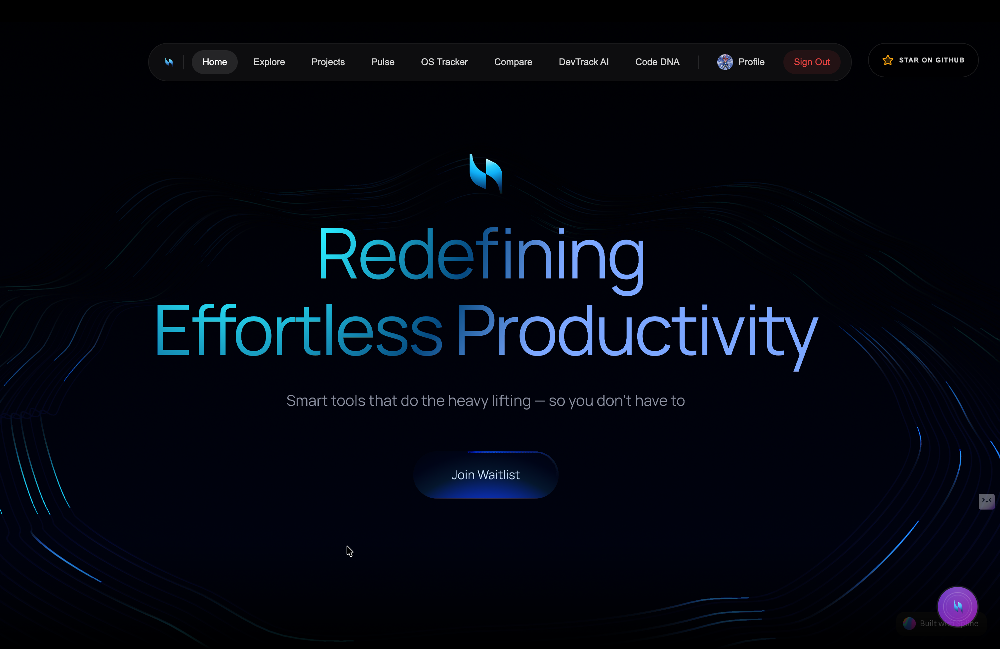
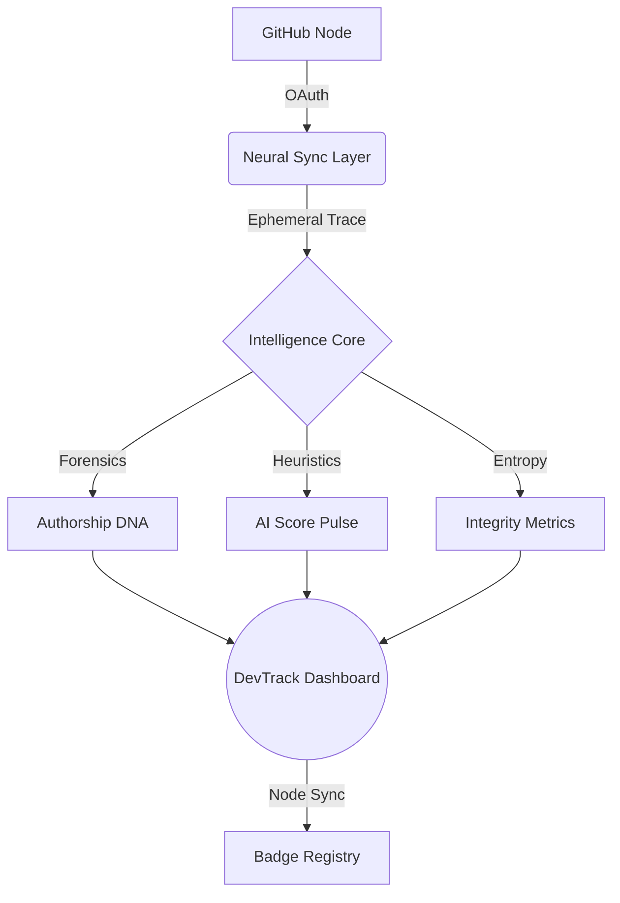

<div align="center">
  

  # 🧬 DevTrack — Neural Intelligence Core
  
  **The ultimate AI-powered developer authorship detection & code integrity platform.**

  [](https://devtrack-seven.vercel.app/)
  [](https://github.com/Tushar8466/devtrack)
  [](https://github.com/Tushar8466/devtrack/tree/main/frontend/devtrack-vscode)
  [](https://github.com/Tushar8466/devtrack/blob/main/LICENSE)

</div>

---

## 🛰️ Vision & Mission

In an era where synthetic code is becoming the norm, **DevTrack** establishes a new standard for engineering trust. It maps the unique "Authorship DNA" of developers across global repository clusters, providing a high-dimensional visualization of code provenance and integrity.

> [!IMPORTANT]
> **Privacy-First Intelligence**: DevTrack never stores your code. All neural scans are ephemeral and processed in isolated memory buffers.

---

## 🚀 Feature Registry

| Sector | Capability | Technical Intelligence |
| :--- | :--- | :--- |
| **🔍 Forensic Scanning** | **AI Detection Pulse** | Heuristic analysis to identify synthetic code with ultra-high accuracy. |
| **🧬 Authorship DNA** | **Neural Mapping** | Unique developer signature extraction using deep vector analysis across repositories. |
| **🛡️ PR Sentinel** | **Code Guard** | Automated GitHub Action to audit AI-risk in pull requests before they are merged. |
| **📊 Real-time Metrics** | **Linguistic Matrix** | High-fidelity visualization of language distribution and repository-level DNA. |
| **🌍 Global Pulse** | **OS Tracker** | Live feed of development nodes synchronized across 40+ repository clusters. |
| **📈 Integrity Rankings** | **Leaderboard Hub** | Public validation of human-verified engineering talent on the DevTrack network. |
| **🖼️ Badge Genesis** | **Authorship Artifacts** | Generate cryptographic badges and exportable DNA cards for developer profiles. |
| **🧩 Extension Node** | **VS Code Integration** | Real-time workspace scanning and DNA exploration directly within the editor. |

---

## 🏗️ Community Evolution (How to Contribute)

DevTrack is a decentralized, open-source project. We invite developers to help expand the neural core and improve global software integrity.

### 🧬 Contribution Lifecycle
1. **Node Synchronization**: [Fork the repository](https://github.com/Tushar8466/devtrack/fork) clusters to your local workspace.
2. **Feature Branching**: Initialize a new tactical branch: `git checkout -b feature/tactical-improvement`.
3. **Neural Commit**: Implement your human-verified changes with clear, atomic commit messages.
4. **Validation Scan**: Ensure all nodes are operational by running `npm run lint` and `npm run build`.
5. **PR Uplink**: [Submit a Pull Request](https://github.com/Tushar8466/devtrack/compare) with a detailed report of the changes.

### 🎯 High-Priority Nodes
- **Neural Engine**: Improving AI-detection heuristics and authorship scoring.
- **UI/UX Node**: Enhancing the high-dimensional dashboard with better visual fidelity.
- **Extension Node**: Adding more interactive features to the VS Code integration.
- **Documentation**: Correcting technical typos and expanding the "Mission Archive".
- **Sentinel API**: Optimizing the GitHub Action for faster real-time auditing.

---

---

## 🛠️ Integrated Systems

### 🧩 VS Code Extension
Bring the power of the Neural Core directly into your engineering workflow.
- **Analyze Workspace**: Run full-repo scans with one click.
- **DNA Explorer**: View authorship metrics for any file in real-time.
- **Status Indicator**: Adaptive "DevTrack: Active" pulse in your status bar.

### 📂 Dynamic Dashboard
- **Linguistic DNA**: Visualize your language distribution and expertise.
- **Temporal Map**: High-dimensional contribution calendar with pulse analysis.
- **Achievement Node**: Earn cryptographic badges for human-verified engineering milestones.

---

## 🏗️ System Architecture



---

## 🚀 Deployment & Installation

### Web Node Setup
```bash
# Clone the neural network
git clone https://github.com/Tushar8466/devtrack.git

# Enter the frontend sector
cd devtrack/frontend

# Install dependencies
npm install

# Initialize development hub
npm run dev
```

### extension Node Setup
1. Open **VS Code**
2. Command Palette (`Cmd+Shift+P`) → **Install from VSIX**
3. Select `devtrack-vscode-0.1.0.vsix` from the `frontend/devtrack-vscode` directory.

---

## 🌍 Tech Stack Matrix

<div align="left">
  
  
  
  
  
  
</div>

---

## 🗺️ Node Registry (Sitemap)

| Route | Tactical Purpose |
| :--- | :--- |
| `/` | **Home Sector** — Mission overview and neural network highlights. |
| `/pulse` | **AI Audit Hub** — Real-time detection and synthetic risk forensics. |
| `/dna` | **Authorship Mapping** — Deep metadata exploration and DNA extraction. |
| `/ai` | **Intelligence Core** — Direct query node for any GitHub repository. |
| `/terminal` | **Satellite Feed** — Live interception of global commit pulses. |
| `/profile` | **Identity Vault** — High-fidelity developer integrity portfolios. |
| `/contribute` | **Mission Protocols** — Detailed guide for joining the open-source evolution. |
| `/compare` | **Vector Analysis** — Dual-node comparison of engineering signatures. |

---

## 🤝 Community & Evolution

DevTrack is a decentralized, open-source initiative. We invite developers to help evolve the mission of human-first engineering.

1. **Fork** the repository clusters.
2. **Commit** human-verified features.
3. **Synchronize** via Pull Requests.

---

<div align="center">
  
  <p><b>Integrated Intelligence Systems © 2026</b></p>
  <p>
    <a href="https://devtrack-seven.vercel.app/">Live Network</a> • 
    <a href="https://github.com/Tushar8466/devtrack">GitHub Cluster</a> • 
    <a href="https://devtrack-seven.vercel.app/contribute">Join the Mission</a>
  </p>
</div>